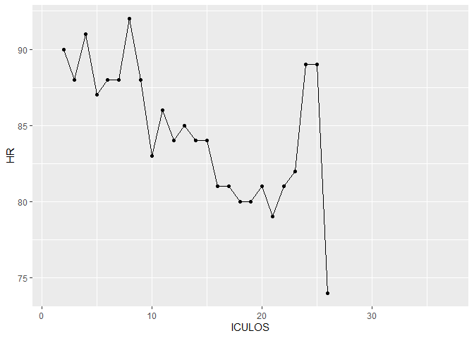
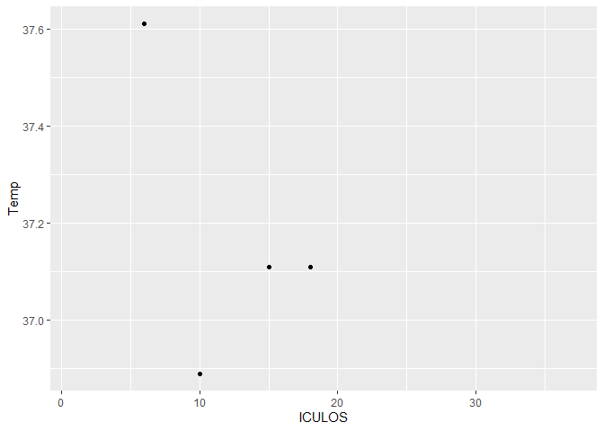
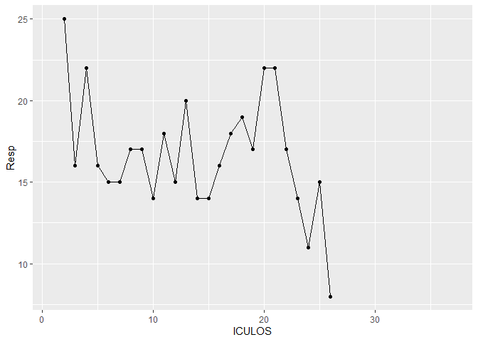

# Sepsis_report
Elzbieta Jodlowska-Siewert

Table of all patients with sepsis and their vital signs:

``` r
#Table 1
sepsis %>% filter(SepsisLabel==1) %>%
        select(-ICULOS, -SepsisLabel, -lastUpdate) %>%
        knitr::kable()
```

| PatientID |  HR | Temp | Resp |
|:----------|----:|-----:|-----:|

The changes in parameters in all patients with sepsis over the last
hour:

``` r
joined <- left_join(sepsis, sepsis_prev, by = "PatientID") 
joined %>% filter(SepsisLabel.x==1) %>%
    mutate(HR_change=HR.x-HR.y, Temp_change=Temp.x-Temp.y, Resp_change=Resp.x-Resp.y) %>%
    select(PatientID, HR_change, Temp_change, Resp_change) %>%
    knitr::kable()
```

| PatientID | HR_change | Temp_change | Resp_change |
|:----------|----------:|------------:|------------:|

Plots of changes in parameters for all patients who currently have
sepsis:

``` r
ids<- sepsis %>% filter(SepsisLabel==0) %>%
  select(PatientID) %>%
  unlist() %>%
  unname()

for (i in ids[2]) {
  a<-getPatient(i)
  a1<-ggplot(data=a, aes(x=ICULOS, y=HR, group=1)) +
  geom_line()+
  geom_point()
  print(a1)
  a2<-ggplot(data=a, aes(x=ICULOS, y=Temp, group=1)) +
  geom_line()+
  geom_point()
  print(a2)
  print(ggplot(data=a, aes(x=ICULOS, y=Resp, group=1)) +
  geom_line()+
  geom_point())
}
```






